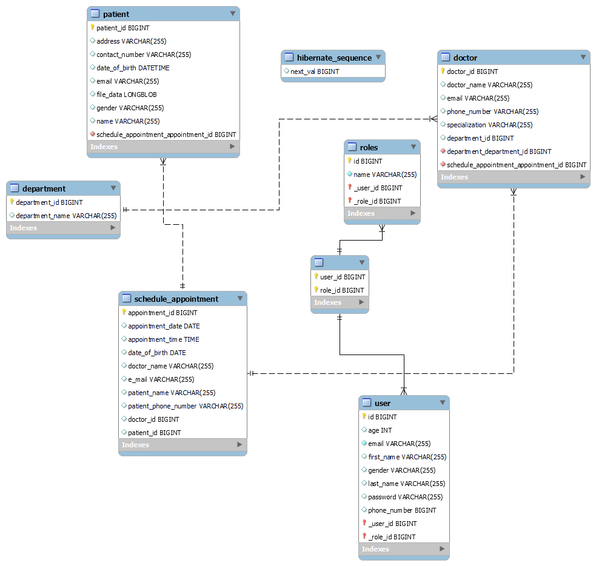

## Hospital Management System

## GitHub Repository

This project is hosted on GitHub. You can find the repository at: https://github.com/Aruna-Selvam/HMS

## Description

The Hospital Management System is a web-based application designed to streamline administrative and operational tasks in a hospital setting. It allows users to manage departments, doctors, patients, appointments, and user roles. The system utilizes JMS (Java Message Service) to send email notifications for scheduled appointments. It also includes features such as patient record management, file uploads, report generation, and appointment scheduling with update and cancellation options.
 
## Features

- Department management: Add and manage different departments in the hospital.
- Doctor management: Maintain doctor information visible to patients and manage doctor records.
- Patient management: Add patient details, upload files as blobs, view patient information, and delete patients.
- User and role management: Register and log in with user accounts. Differentiate roles between admin and user.
- Schedule appointment: Create, update, and cancel appointments. Send email notifications using JMS.
- File management: Upload patient files as blobs and download reports as PDF using Text Stripper.
- Logging: Utilize SLF4J for logging purposes.
- Cron jobs: Set up cron jobs to send reminders to patients before their appointments.

## Installation

1. Clone the repository: `git clone https://github.com/Aruna-Selvam/HMS.git`
2. Navigate to the project directory: `cd hospital-management`
3. Configure the MySQL database connection in `application.properties`.
4. Build the project: `mvn clean install`
5. Run the application: `java -jar target/hospital-management-systme.jar`

## Schema Diagram

## Usage
Create Database HMS before using the project.
1. Open a web browser and go to `http://localhost:8082`
2. Register an account or log in with existing credentials.
3. Explore the various functionalities of the system, including department, doctor, patient, and appointment management.
4. Schedule appointments, update or cancel existing appointments.
5. Upload patient files and download reports as PDF.
6. Manage users and roles according to their permissions.
   On the admin page, you can view the following statistics:

- Number of Appointments: Displays the total number of appointments in the system.
- Number of Patients: Shows the total count of patients registered in the system.
- Number of Doctors: Presents the total count of doctors registered in the system.

These statistics provide an overview of the current state of the system and help administrators track key metrics.

## Testing

The Hospital Management System includes comprehensive unit tests using JUnit and Mockito. Some of the key tests performed include:

Parameterized tests for user creation, where different userDto objects are used to test the createUser() method in UserService.

## Custom Queries

The application uses custom queries in the repository classes to perform specific database operations.

## Constant Variable

Utilized constant variables in Patient Controller for File Uploads.

## Exception Handling

- The GlobalExceptionHandler class centrally handles exceptions in the Hospital Management System, providing custom error messages and appropriate responses.
- It gracefully handles the AppointmentTimeAlreadyExistsException, NoPatientsFoundException, PatientNotFoundException, and DataNotFoundException to ensure smooth operation.
- For generic runtime errors, it redirects to an error page and displays the specific error message retrieved from the exception.
- With its centralized exception handling, the class ensures a robust and user-friendly experience by addressing various error scenarios efficiently.

## Bean Creation

Beans created using various methods all over the project.

## Session Management

I used Session management in Security Configuration.
The sessionManagement section defines session-related settings such as maximum sessions, preventing multiple logins, and the URL to redirect when a session expires.

## Technologies Used

- Spring Boot
- Spring Security
- Thymeleaf
- SLF4J
- MySQL
- JMS
- HTML
- CSS
- JavaScript
- Bootstrap
- Ajax
## Contributing

Contributions are welcome! If you have any suggestions or found a bug, please open an issue or submit a pull request.

## Contact
For any questions or inquiries, please contact:
- Name: Aruna Selvam
- Email: arunaselvam23@gmail.com

Thank you for your interest in the Hospital Management System!

